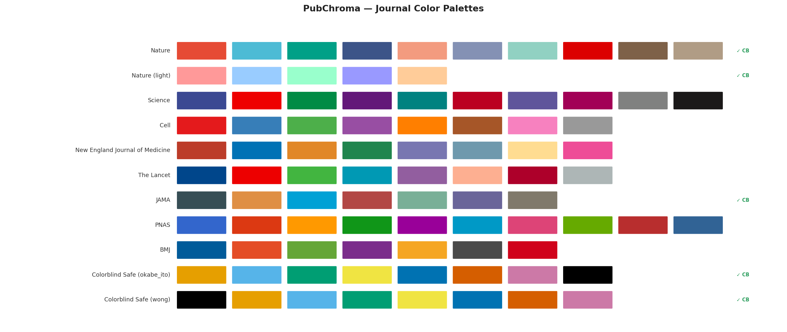

# PubChroma

**Journal-inspired color palettes for scientific figures** — Python and R, with a single source of truth.

[](https://github.com/tyuan2024/pubchroma/actions/workflows/python.yml)
[](https://github.com/tyuan2024/pubchroma/actions/workflows/r.yml)
[](LICENSE)

## Overview

PubChroma provides color palettes that match the visual style of major scientific journals, making it easy to produce publication-quality figures for biomedical and engineering papers.

**Supported journals**: Nature, Science, Cell, NEJM, Lancet, JAMA, PNAS, BMJ, plus universal colorblind-safe palettes.



## Installation

### Python

```bash
pip install pubchroma
```

### R

```r
# From GitHub (development version)
remotes::install_github("tyuan2024/pubchroma", subdir = "R")
```

## Quick Start

### Python

```python
import pubchroma as pc

# List available journals
pc.list_journals()
# ['bmj', 'cell', 'colorblind', 'jama', 'lancet', 'nature', 'nejm', 'pnas', 'science']

# Get colors for Nature
pc.get_colors("nature", n=5)
# ['#E64B35', '#4DBBD5', '#00A087', '#3C5488', '#F39B7F']

# Check colorblind safety
pc.is_colorblind_safe("nature")   # True
pc.is_colorblind_safe("science")  # False

# Get a colorblind-safe palette
pc.get_colors("colorblind", "okabe_ito")

# List all colorblind-safe palettes
pc.list_colorblind_safe()
```

### R

```r
library(pubchroma)

# List available journals
list_journals()

# Get colors for NEJM
get_colors("nejm", n = 5)

# Check colorblind safety
is_colorblind_safe("nature")   # TRUE
is_colorblind_safe("science")  # FALSE

# List all colorblind-safe palettes
list_colorblind_safe()
```

## ggplot2 Integration

```r
library(ggplot2)
library(pubchroma)

# Scatter plot with Nature palette
ggplot(mtcars, aes(wt, mpg, colour = factor(cyl))) +
  geom_point(size = 3) +
  scale_color_pubchroma("nature") +
  theme_classic()

# Bar chart with JAMA palette
ggplot(mtcars, aes(factor(cyl), fill = factor(cyl))) +
  geom_bar() +
  scale_fill_pubchroma("jama") +
  theme_classic()

# Reverse palette order
ggplot(mtcars, aes(wt, mpg, colour = factor(cyl))) +
  geom_point() +
  scale_color_pubchroma("nejm", direction = -1)
```

Available scales:

| Function | Aesthetic |
|---|---|
| `scale_color_pubchroma(journal, palette, direction)` | colour |
| `scale_colour_pubchroma(journal, palette, direction)` | colour (alias) |
| `scale_fill_pubchroma(journal, palette, direction)` | fill |
| `pubchroma_pal(journal, palette, direction)` | raw palette function |

## API Reference

Both Python and R expose identical function names:

| Function | Description |
|---|---|
| `list_journals()` | All available journal keys |
| `list_palettes(journal)` | Palette names for a journal |
| `get_palette(journal, palette)` | Full palette metadata |
| `get_colors(journal, palette, n, colorblind_only)` | Hex color codes |
| `is_colorblind_safe(journal, palette)` | Colorblind-safety check |
| `list_colorblind_safe()` | All colorblind-safe palettes |

## Data

All palette data lives in [`data/palettes/journals.json`](data/palettes/journals.json) — a single source of truth for both languages.

## License

MIT — see [LICENSE](LICENSE).
